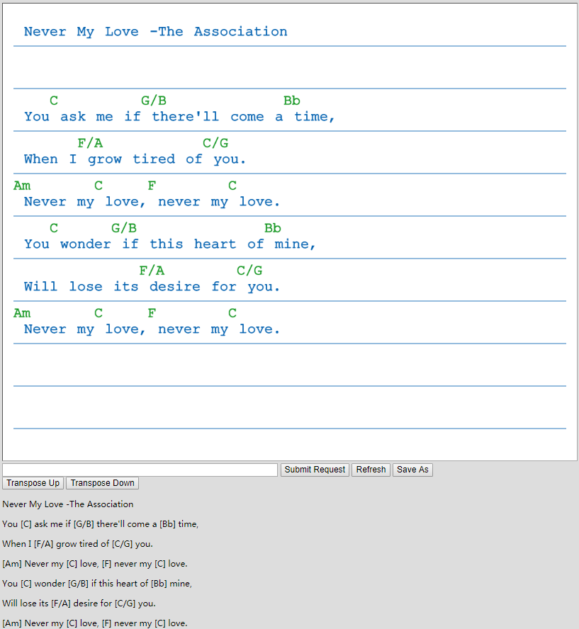
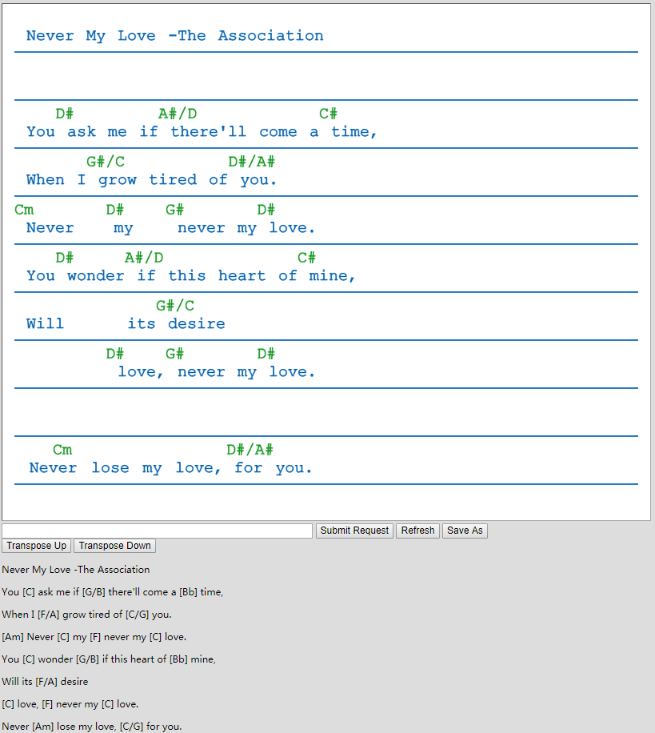

# chord-pro-web-app
Authors: Dr. Louis D. Nel, Sarah Li

## Overview:
A single page web application that reads lyrics and chords from text files and displays them on the webpage.
The user can interact with the words by dragging them around on the canvas and transposing the chords up and down. The user can also save their modified text files.

## Source Files:
- `server.js`, server
- `canvas.js`, client

## Launching Instructions:
1. Go to the folder where server.js is located
2. Make sure the "html" and "songs" folder are also in that directory
3. Open the command line and change the directory to where the files are located
4. Type `node server.js` and hit the Enter key to run the program

## Operating Instructions:
1. Go to "http://localhost:3000/chord-pro-web-app.html"
2. Interact with the application
    - enter or select song name
    - drag the words around
    - click the "Transpose Up", "Transpose Down", and "Refresh" buttons
    - save the file by typing in a file name and click the "Save As" button

## Screenshots:

